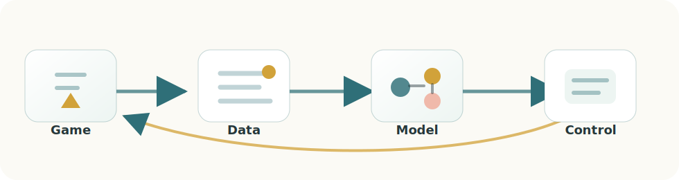

# STS2 AI 项目说明

STS2 AI Workspace 是一个面向 Slay the Spire 2 的本地 AI 工作区。它把游戏 Mod、本地网页控制台、数据采集、BC 模型训练和 OpenAI-compatible LLM 接入放在一起，目标是建立一条可持续迭代的训练闭环。

当前项目仍是半成品：控制台、采集、训练和 LLM 接入已经跑通，但缺少大量高质量实战数据，AI 稳定性还需要继续验证。

> 说明：公开仓库内使用的是项目自绘示意图和 Logo，不直接抽取游戏原始素材。这样更适合开源展示，也避免把受版权保护的游戏资源放进仓库。

## 这个项目要解决什么

- 让玩家能在本地采集自己的对局数据。
- 让基础 AI 可以托管战斗，并把行为记录下来。
- 让 LLM 作为“决策脑”，在合法候选动作里选择动作。
- 让控制台统一管理启动、状态观察、数据打包、重训和评估。
- 逐步把玩家数据和 AI 数据整理成可训练的数据集。

## 当前能做什么

| 能力 | 说明 |
| --- | --- |
| 游戏状态读取 | 读取场景、血量、能量、手牌、药水、敌人、Run 状态。 |
| 战斗 AI | 基础 AI 可自动战斗；LLM 可参与战斗决策。 |
| 宏观操作 | 可处理地图、奖励、选卡、事件、休息点；商店默认更保守。 |
| 数据采集 | 记录玩家和 AI 的战斗、宏观动作、Run 质量、怪物信息。 |
| 训练闭环 | 支持重建数据、重训 BC、查看评测和最近 Run。 |
| 数据贡献 | 支持一键打包本地数据库，提交给维护者扩充样本。 |

## 控制台入口

- `项目说明`：解释项目整体目标、当前能力、推荐流程和限制。
- `新手引导`：覆盖当前页面，用高亮和箭头指向具体控件。
- 顶部状态：优先判断游戏连接、AI 接管、采集状态和当前 Run。
- 实时采集动态：只显示最近几条动作，用来确认系统正在读数据。
- 左侧工作区：打开、收起或定位右侧模块。
- 右侧模块：查看 AI/LLM 决策、最近 Run、采集记录、评测和训练输出。

## 推荐使用流程

1. 启动游戏、Mod API 和控制台。
2. 确认顶部“游戏连接”不是未连接。
3. 正式采数据时打开“采集总开关”；临时测试时可以关闭。
4. 演示基础 AI 时打开“允许 AI 出牌”。
5. 演示 LLM 时优先使用“只从合法候选动作里选”。
6. 先观察 LLM 建议，再决定是否打开“允许 LLM 自动战斗”。
7. 每局结束后检查最近 Run 和质量标记。
8. 需要贡献数据时，用“一键打包数据库”生成 zip。

## 关键原则

- LLM 不应直接自由构造游戏动作。推荐模式下，系统先生成合法候选动作，LLM 只能从候选动作中选择。
- 数据质量比数量更重要。异常 Run、卡死、误操作或明显坏数据应标记或丢弃。
- API Key、训练产物和本地数据默认留在本机，不提交 Git。
- 宏观操作要保守开启，尤其是商店和事件。

## 当前限制

- 样本量仍不足，训练效果会随数据质量明显波动。
- 基础 AI 和 LLM 都不能保证稳定打过 Act 1 Boss。
- 宏观操作还需要更多规则、测试和数据支持。
- 控制台是本地工具，不替代游戏本体判断，也不保证所有 Mod/API 异常都能自动恢复。

## 相关文档

这些是 Git 上公开维护的说明文档，控制台“项目说明”里也会提及并提供本地可打开入口。

- `docs/project_guide.md`：项目目标、当前能力、推荐流程和限制。
- `docs/startup.md`：一键启动控制台、日志窗口、BC AI 和 LLM。
- `docs/data_contribution.md`：如何打包本地数据并提交给维护者。
- `docs/public_roadmap.md`：当前状态、近期目标和公开发展路线。
- `docs/monster_data.md`：怪物采集字段、用途和后续训练接入方式。
